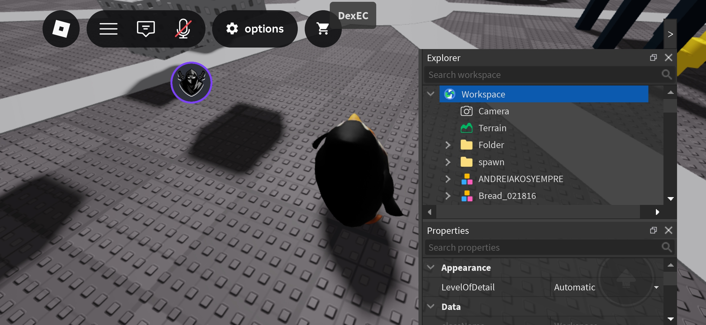

# Dex++


Dex: Eclipse is an extended version of Moon's Dex, made to fulfill some Moon's Dex prophecy.

## Latest Version Script
```lua
loadstring(game:HttpGet("https://github.com/rileybeerblx1/DexEclipse/releases/download/Dex/out.lua"))()
```
For specific versions, go to [releases](https://github.com/rileybeerblx1/DexEclipse/releases).

## What's the difference between Dex and Dex: Eclipse?
Since the original Dex is the last release and Moon have discontinued it, it still has some missing features.
Here are the features that were added/fixed in Dex: Eclipse
- Using New Roblox Studio Icons
- Updated API
- Uses Konstant, [Advanced Decompiler](https://github.com/w-a-e/Advanced-Decompiler-V3) and [Shiny](https://github.com/AZYsGithub/shiny)/[Medal](https://github.com/shrimp-nz/medal) as fallback decompilers (for shitsploits who doesn't have it)
    > 'getscriptbytecode' is required
- Uses [USSI](https://github.com/luau/UniversalSynSaveInstance/tree/main) as fallback saveinstance
- Mobile Input Support (Window drag, resizing works fully on touch)
- Console Output
- Model Viewer (basically 3D Preview)
- Revived Save Instance (original Dex doesnt have it, but does in Dex 2.0)
- Click part to select (thx Toon :3)
- CodeFrame cursor offset (where cursor on textbox were not aligned properly)
- Mobile Support

## To Build
1. Download this repository
2. Ensure you have Python 3 (I use 3.9.0)
3. Run build.py
4. The executable script will be created as out.lua

## About Dex Roadmap
The concept of the Dex roadmap is amazing, however neither me nor Moon have the ability to fulfil the full roadmap. I did have added few stuffs in my fork but mostly of them are beyond my limit and i did this project for fun.

## Our Discord Server
https://discord.gg/au8CpZBCXg

## Donation
Every donation is highly apreciated, this is compeletely optional.
- bc1q0x9d5zram779h7ffsz76pjafwsksy2dzkyv04p (BTC)
- ltc1qau7tmqckt4ajvaalart0errwgkwu7n472k3txj (LTC)
- 0xdf1e37601F91E36ea571ef28E50AE75cF03B7605 (ETH)

## Third Party Components
- Konstant Decompiler (Let me know)
- [UniversalSynapseSaveInstance (USSI)](https://github.com/luau/UniversalSynSaveInstance)
- [Advanced Decompiler](https://github.com/w-a-e/Advanced-Decompiler-V3)
- [Shiny](https://github.com/rocult/shiny)/[Medal](https://github.com/shrimp-nz/medal)

## License
[](https://github.com/rileybeerblx1/DexEclipse/blob/main/LICENSE)

[](https://github.com/luau/UniversalSynSaveInstance/blob/main/LICENSE)

## Credits
- [Riley](https://github.com/rileybeerblx1) - Dex: Eclipse Maintainer
- [Chillz](https://github.com/AZYsGithub) – Dex++ Owner 
- [Cazan](https://github.com/Cazzanos) – Helped me develop the Model Viewer  
- [Moon](https://github.com/LorekeeperZinnia/Dex) – Original Dex Explorer  
- [Toon](https://github.com/Toon-arch) – Contributor and IY's Dex parts and components
